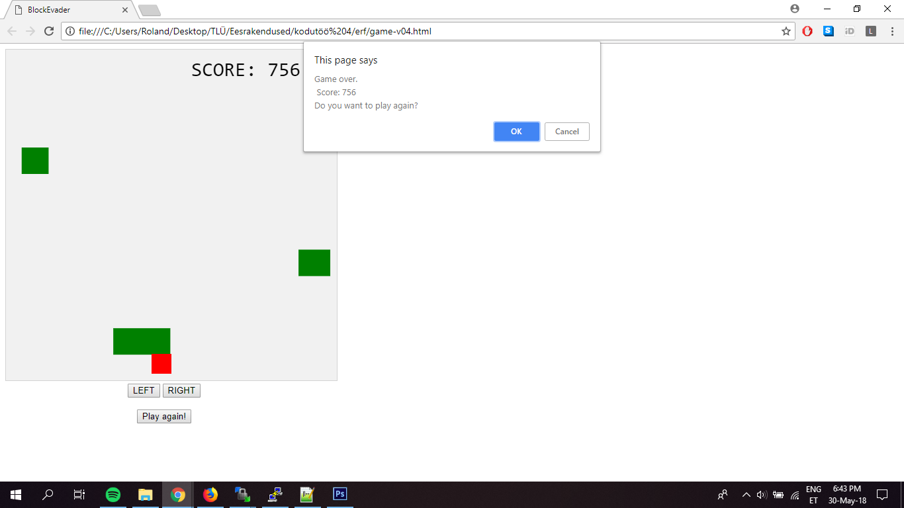
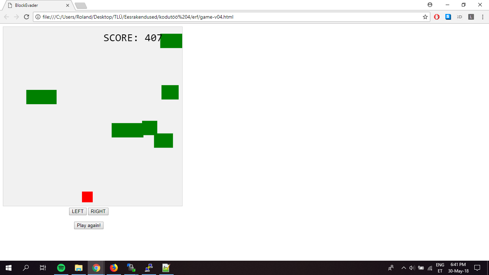

# 4. kodutöö – Võrguta olekus töötav rakendus

	rakenduse nimi: BlockEvader

	Autorid: Caspar Sepp ja Roland Kasenurm
	
	Kirjeldus: Rakenduseks on mäng, kus mängija eesmärgiks on eemale põigata laest kukkuvatest kastidest.
	Pidevalt suureneb skoor ja kastide kukkumiskiirus suureneb iga kastiga. Pidevalt varieerub kastide kukkumise asukoht ja suurus.
	Mäng lõppeb, kui mingi objekt kukub mängija pihta.
	
	
	

	Inspiratsiooni ja koodijuppe vıetud: https://www.w3schools.com/graphics/game_intro.asp

	http://greeny.cs.tlu.ee/~kaserola/Eesrakendused/4.ea-kodutoo/game-v04.html

### Tähtpäev on valitud põhieksamiaeg (25.05 või 31.05)

## Nõuded

1. Töö tuleb teha vähemalt kahekesi, eelnevalt kokkuleppel on lubatud ka kolm liiget. GitHub'is peab eristuma, kes mida tegi!
1. README.md fail sisaldab:
    * suurelt rakenduse nime; 
    * autorite nimesid; 
    * rakenduse funktsionaalsuse kirjeldust;
    * ekraanitõmmist rakendusest.
1. Rakenduse puhul peavad olema täidetud vähemalt järgmised nõuded:
    * rakendus lahendab tõsist probleemi või on meelelahutusliku eesmärgiga; 
    * rakenduse idee peab olema kooskõlastatud õppejõuga (võib kirjutada Slack'i); 
    * keerukuselt peab ületama 6. tunni vanasõnade näidet; 
    * töötab võrguta olekus, st kasutab ServiceWorker'it;
    * töötab hästi väikese ekraaniga seadmel (mobiilil);  
    * on loodud vajalikes suurustes ikoonid kasutamaks "add to Home screen" funktsionaalsust.
    * võib kasutada teiste autorite koodi, kuid enda panus peab olema natuke enamat kui võrguta olekus töötamine. 
	

	
