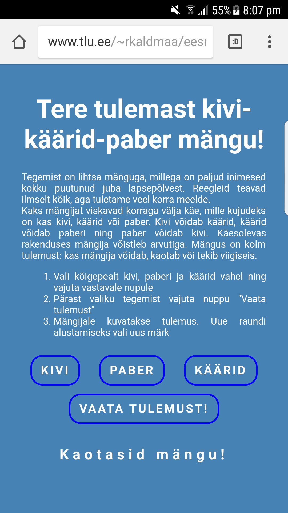

# 4. kodutöö – Võrguta olekus töötav rakendus

Rakenduse nimi: Kivi-käärid-paber mäng

Autorid: Rauno Kaldmaa

Kivi-käärid-paber algeline mängu kood, mida on vastavalt kodutöö nõuetele kohandatud: http://jsfiddle.net/2jqz51Ly/

Rakenduse kirjeldus: 
Tegemist on kivi-käärid-paber mänguga, milles mängija võistleb arvutiga. Arvuti valib läbi random funktsiooni endale väärtuse hulgast kivi, paber või käärid. Seejärel valib mängija samuti ühe nendest valikutest. Vastavalt mängu reeglitele kirjutatakse arvutiekraanile, kas mängija võitis, kaotas või jäi viiki.

1. Vali kõigepealt kivi, paberi ja käärid vahel ning vajuta vastavale nupule
2. Pärast valiku tegemist vajuta nuppu "Vaata tulemust"
3. Mängijale kuvatakse tulemus. Uue raundi alustamiseks vali uus märk

Aadress: http://www.tlu.ee/~rkaldmaa/eesrakendused/kkp/kkp-game.html

Ekraanipilt:

