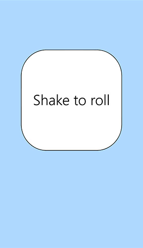
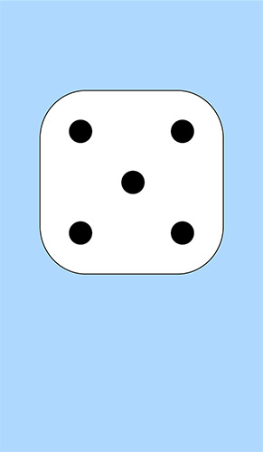

# 4. kodutöö – Võrguta olekus töötav rakendus

# Dice

Autorid: Tauri Taevik, Kert Tamm

Tegemist on täringuveeratamis mänguga, mis on mõeldud mobiilseadmetele.
Täringu veeretamiseks tuleb mobiilseadet raputada ning oodata kuni täring lõpetab veeremise.
Lühike värin annab teada veeretamise algusest, pikem värin veeretamise lõppemisest.
Uuesti veeretamiseks tuleb mobiilseadet uuesti raputada.
Mäng toimib ka võrguta olekus.
Pilti kuvatakse portait vaates.

https://www.tlu.ee/~ttaevik/dice/

allikad:

http://jsfiddle.net/gaby/zZUgF/262/
https://www.creativebloq.com/web-design/master-screen-orientation-html5-101517371

Screenshotid:

