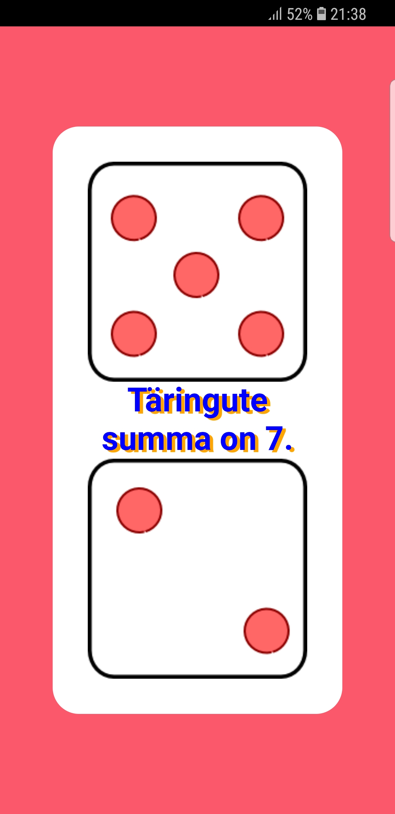
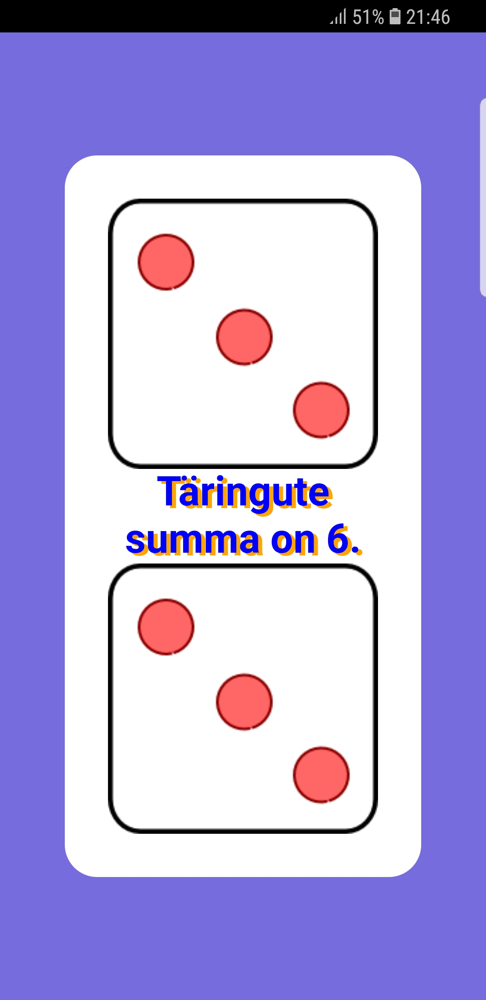

# 4. kodutöö – Võrguta olekus töötav rakendus

# Täringute viskamine

### Tähtpäev on 25.05.2018

1. Autorid - Valeri Valentinov, Konstantin Blinkov, Igor Filippov
2. Funktsionaalsus - Täringu puudumisel, saab "veeretada" täringut telefonis - pigem telefoni raputamisel 
loositakse välja kaks erinevat täringut. Täpsemalt rääkides, loositakse kaks erinevat numbrit ja seejärel lisatakse nende arvule sobiva pildi ekraanile.
Ekraanil on ka kiri, kus on kirjas kahe täringu summa. Iga kord, kui raputatakse telefoni, muutub ka taustavärv.

