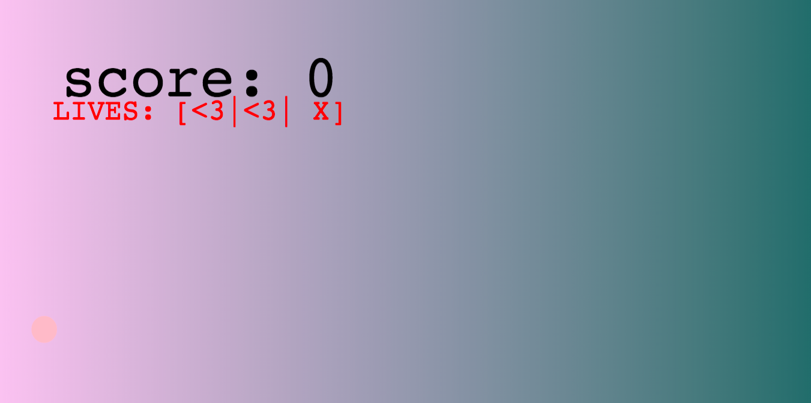

# 4. kodutöö – Võrguta olekus töötav rakendus

### Tähtpäev on valitud põhieksamiaeg (25.05 või 31.05)

Rakenduse nimi: MULLI MÄNG

Autorid: Hendrik Heinsar ja Krister Riska

Kirjeldus:
Rakendus on mäng, kus tuleb "lõhkuda" mulle. Iga lõhutud mulli eest saab skoori +10. Mängija eesmärk on saada nii suur ksoor kui võimalik. Kui mängija ei jõua "hävitada" 3 mulli, siis skoor nullitakse ehk mängija "sureb". Mullide kahanemis kiirus tõuseb iga lõhutud mulliga.
Mäng töötab serviceWorkeriga offlines.

1. Töö tuleb teha vähemalt kahekesi, eelnevalt kokkuleppel on lubatud ka kolm liiget. GitHub'is peab eristuma, kes mida tegi!
1. README.md fail sisaldab:
    * suurelt rakenduse nime; 
    * autorite nimesid; 
    * rakenduse funktsionaalsuse kirjeldust;
    * ekraanitõmmist rakendusest.
1. Rakenduse puhul peavad olema täidetud vähemalt järgmised nõuded:
    * rakendus lahendab tõsist probleemi või on meelelahutusliku eesmärgiga; 
    * rakenduse idee peab olema kooskõlastatud õppejõuga (võib kirjutada Slack'i); 
    * keerukuselt peab ületama 6. tunni vanasõnade näidet; 
    * töötab võrguta olekus, st kasutab ServiceWorker'it;
    * töötab hästi väikese ekraaniga seadmel (mobiilil);  
    * on loodud vajalikes suurustes ikoonid kasutamaks "add to Home screen" funktsionaalsust.
    * võib kasutada teiste autorite koodi, kuid enda panus peab olema natuke enamat kui võrguta olekus töötamine. 
