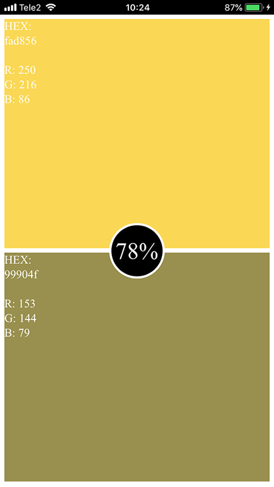
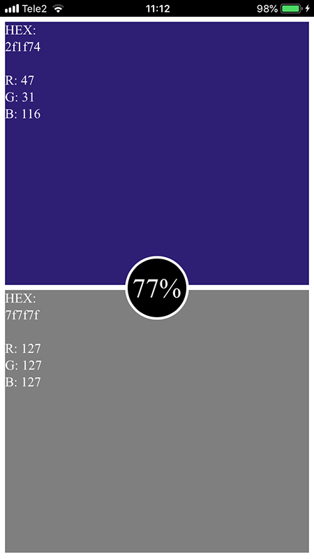

# RGB Game  
### Autorid: Martin Sõmer, Veli Vaigur  
  
###  Funktsionaalsus  
Lehele minnes fikseerib rakendus telefoni positsiooni ja võtab selle algpositsiooniks. Seejärel genereerib suvalise RGB värvi, mis tuleb telefoni erinevate telgede suhtes liigutades saavutada. Telefoni X, Y ja Z teljed on vastavalt R, G ja B väärtustega võrduma pandud. Ekraani keskel näitab üldist protsenti, kui lähedal ollakse etteantud värvile. Ekraanile vajutades tulevad nii etteantud kui ka hetke seisu värvi RGB ja HEX koodid nähtavale.  
  
### Screenshotid  
  

